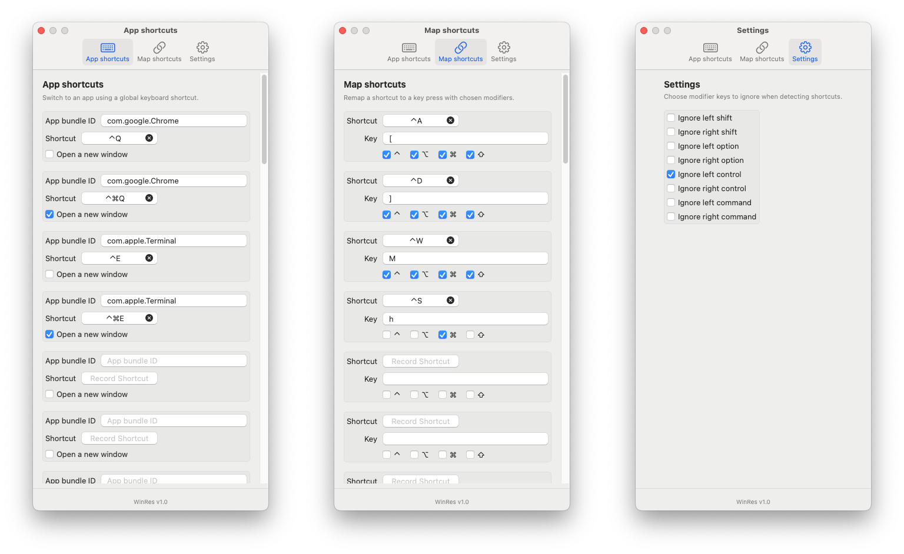

# WinRes

A macOS utility that provides global keyboard shortcuts for application switching and other customizable actions.



## Use case example

### Shortcuts example

1. `Caps Lock + Q` switches to Google Chrome and `Caps Lock + Command + Q` opens a new Google Chrome window.  
2. `Caps Lock + E` switches to Terminal and `Caps Lock + Command + E` opens a new Terminal window.  
3. `Caps Lock + W` maximizes the window, `Caps Lock + A` tiles the window to the left, and `Caps Lock + D` tiles the window to the right.

### How to set up these shortcuts

1. Remap your Caps Lock to the **right** Control key. To do this: **System Settings → Keyboard → Keyboard Shortcuts → Modifier Keys** and select **⌃ Control** for **Caps Lock ⇪ key**.  
2. Open the WinRes settings window, go to the **Settings** tab, and enable **Ignore left control**.  
3. In WinRes, open the **App shortcuts** tab and set a `Control + Q` shortcut for Google Chrome. After this, pressing `Caps Lock + Q` should switch to Google Chrome; pressing **Left Control + Q** should do nothing (WinRes will ignore the left control).  
4. In the **App shortcuts** tab, set `Control + Command + Q` to open a new Google Chrome window.  
5. Repeat the same setup for the Terminal app (`Control + E` and `Control + Command + E`).  
6. Set up window-tiling shortcuts. WinRes does not implement window tiling by itself, but it allows you to map shortcuts that can trigger this functionality. Starting with macOS 15 (Sequoia), window-tiling hotkeys are provided by macOS itself. Go to **System Settings → Keyboard → Keyboard Shortcuts → Windows → Halves** and assign `⌃⌥⇧⌘A` shortcut to **Tile Left Half**, or choose any shortcut you prefer.  
7. In WinRes → **Map shortcuts**, map `Control + A` to the `A` key with all four modifiers enabled. Now, pressing `Caps Lock + A` should tile the focused window to the left.  
8. Repeat the same steps for the shortcut that tiles a window to the right and for the shortcut that maximizes a window.

## App switching logic

The app switching logic works as follows:

1. If the app is not running, it will be launched.  
2. If the app is running but has no windows, a new window will be opened.  
3. If the app has open windows, focus will switch to the most recently used one.  
4. If a window of the app is already focused, focus will switch to the next window of that app.

## Installation

1. Go to [the releases page](https://github.com/mdmitry01/WinRes/releases) and download the latest version.  
2. Double-click the downloaded `.dmg` file.  
3. Drag the WinRes application into your **Applications** folder.  
4. When you launch WinRes, you'll get the following warning: "Apple cannot check it for malicious software." This is because the WinRes app is not signed and notarized by Apple. Notarization requires Apple Developer Program membership (paid). See Apple's article for details: https://support.apple.com/en-us/HT202491. You can bypass this warning - see Apple's instructions here: https://support.apple.com/guide/mac-help/apple-cant-check-app-for-malicious-software-mchleab3a043/15.0/mac/15.0 .

## How to use

After launching WinRes, its icon appears in the menu bar. Click it and select **Settings**. On first launch, the app will request Accessibility permissions — grant these at your discretion, WinRes requires them to function. In the settings window you can assign shortcuts to quickly switch between applications.

For example, to create a shortcut for Google Chrome you need its bundle ID. Run this in Terminal:

```bash
osascript -e 'id of app "Google Chrome"'
```

The command returns `com.google.Chrome`. Enter this value in the **App bundle ID** field, then click the **Shortcut** field to assign a shortcut. If you want the shortcut to always open a new window, enable **Open a new window**.

For details about the "Map shortcuts" and "Settings" tabs, see the ["Use case example"](#use-case-example) section above.

## How to build

1. Open this project in Xcode.  
2. Increase the version number if needed, see: https://stackoverflow.com/a/47945146
3. From the menu bar select **Product → Archive**.  
4. In the **Archives** window, choose the archive you want and click **Distribute App**.  
5. Choose **Copy App** as the distribution method.  
6. Provide a name and location, then click **Export**.  
7. Use Disk Utility to create a `.dmg` from the exported app:  
   1. Disk Utility → **File → New Image → Image from Folder**.  
   2. Select the folder containing the exported app and create the image.

## Compatibility

WinRes works with the latest macOS version, Sequoia 15.6.1, at the time of writing. It should also work with macOS 14, although this hasn't been tested. It may work with macOS 13 as well, but again, this hasn't been tested.
